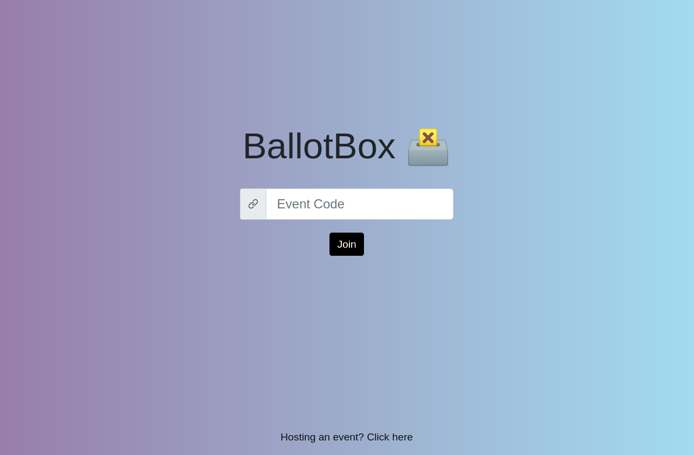

# BallotBox 🗳️

## Launching the project
Run `docker-compose up`. The website is accessible at `http://localhost:3000`.

## Unit testing the backend component
Run `sh test_backend.sh`.

NOTE: an instance of a MongoDB must be running (`root`/`example` credentials) and the requirements in `backend/requirements.txt` must be installed.
